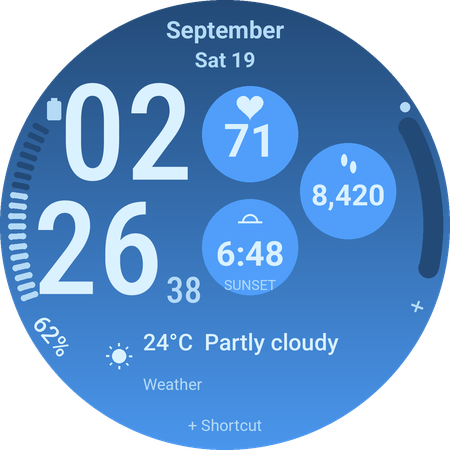

# Ultra Info Board

A Galaxy Watch face with a blue gradient, large stacked time and seven editable complication areas. The new **Wear OS 6 Samsung forecast preview** bundles the resource-only face, permission setup and an interchangeable hourly weather provider in one APK.

**Start with the [Samsung forecast installation and comparison guide](docs/SAMSUNG_FORECAST_TESTING.md).** Download `weatherbridge-debug.apk` from the `samsung-forecast-preview` artifact in [this workflow](https://github.com/DylanMc25/ultrawatchfaceedits/actions/workflows/samsung-weather.yml). The physical Galaxy Watch now reads Samsung's forecast in the setup app, and the user reports that it appears correct. On-face interactions and detailed comparisons are still being checked. This is a development preview, not a store release.

The original standalone `:app` remains available on Wear OS 5+ as `com.example.ultrainfoboard`. Its layout and installation notes below describe version 0.1.6; the new preview uses the same layout with its own default forecast provider. Final branding, package identity and release signing remain release prerequisites.



*Illustrative layout with explicit sample data, not an emulator capture. Native captures and their tested versions are recorded in [validation evidence](docs/VALIDATION.md).*

## Layout

- Month and day/date above larger stacked hours/minutes (142-unit type); seconds have a separate column.
- The familiar three staggered circles on the right: heart rate, steps and sunrise/sunset. Larger 90-unit circles use up to 38-unit type, with smaller sizes for longer readings.
- Segmented left battery gauge, thick right-edge arc, provider icons and angled edge labels. Right edge and bottom shortcut start unassigned.
- One compact **Bottom rectangle** for compatible installed apps' text, image and progress complications. No heavy background fill.
- Black always-on display with thin time and date; all complications are hidden.

Long-press the face and choose **Customize → Complications → Bottom rectangle** (or tap the rectangle in the editor). Choose an installed provider, such as Weather, calendar or a compatible image/chart provider. The provider owns the data, units and whole-area tap action. Time follows the device's 12/24-hour preference. A `+` marks an empty slot; missing text is a dash.

Samsung's **public Weather complication** is the preferred default when installed and eligible; otherwise the rectangle starts empty. If necessary, select Weather manually and complete any provider permission/setup prompt. This provider supplies current conditions, **not Info Brick's hourly forecast**. Other apps appear only if they expose a supported complication type. An image provider can supply its own chart; the face does not generate history or manufacture forecasts.

**Updating from 0.1.5:** the fixed Bottom panel menu is replaced with standard editable slot 7. IDs 1–6 and their geometry remain unchanged. Choose the bottom provider in Complications; the old menu choice does not map to a provider assignment. A consistently signed update is needed to test retention of saved assignments. No companion app or private Samsung interface is used.

The physical 0.1.5 test reported `Weather —` while its tap correctly opened Samsung Weather with location and forecast data. That establishes a native weather availability problem in our face, not an empty Samsung Weather app. Version 0.1.6 uses provider data instead; its Samsung data/taps still require a physical check. See [research and compatibility](docs/SAMSUNG_WEATHER.md).

**Samsung forecast preview:** a new Wear OS 6 app bundles the face and a replaceable hourly forecast complication that reads Samsung Weather's cache with the user's permission. It follows Samsung's saved location, units and hourly selection, and opens Samsung Weather when tapped. [Install and test the preview](docs/SAMSUNG_FORECAST_TESTING.md). Permission access and matching readings on the physical watch remain unverified; this is not a production-ready Samsung integration. The original `:app` build above remains available while the new `:weatherbridge` / `:pushface` path is tested.

## Build and install

Install JDK 17, Python 3 and Node.js 22 (for fixture checks), Android SDK command-line tools, platform 35 and build-tools 35.0.0. Set `ANDROID_HOME` or create ignored `local.properties` with `sdk.dir=/your/android/sdk`.

```sh
sdkmanager 'platforms;android-35' 'build-tools;35.0.0' 'platform-tools'
./gradlew :app:assembleDebug :app:bundleRelease
adb install -r app/build/outputs/apk/debug/app-debug.apk
adb shell am broadcast -a com.google.android.wearable.app.DEBUG_SURFACE \
  --es operation set-watchface --es watchFaceId com.example.ultrainfoboard
```

The debug APK is installable and signed with the development key. The release AAB is **unsigned**, for later release preparation. Both builds remove generated Android resource bytecode so no DEX is packaged. Do not enable resource shrinking: resources referenced in raw WFF XML must remain available.

CI runners generate temporary debug signing keys. If an update from a different runner fails with `INSTALL_FAILED_UPDATE_INCOMPATIBLE`, uninstall the earlier development build before installing the new one; this resets that build's watch-face settings. Stable release signing is a later milestone.

### Test a downloaded APK in Android Studio on Windows

1. In Android Studio's **Device Manager**, create and start a round Wear OS API 34 or API 35 virtual device.
2. Open the latest successful [GitHub Actions run](https://github.com/DylanMc25/ultrawatchfaceedits/actions/workflows/watchface.yml?query=branch%3Acodex%2Fwatchface-redesign) and download **watchface-build-and-reports** under **Artifacts**. Extract the ZIP and locate `app-debug.apk`.
3. Drag the APK onto the running emulator. This package is a watch face, so it has no normal app launch screen.
4. Long-press the current watch face, add **Ultra Info Board**, and select it. Long-press again and choose **Customize** or **Edit** to assign complications.

If installation reports mismatched signatures, run this in PowerShell while only one emulator is running, then drag the new APK onto it again:

```powershell
& "$env:LOCALAPPDATA\Android\Sdk\platform-tools\adb.exe" -e uninstall com.example.ultrainfoboard
```

Expect `Success`. Uninstalling resets this face's saved complication choices. The full path avoids the `adb is not recognized` error; if your SDK is elsewhere, use its location from Android Studio's SDK Manager.

For a physical Galaxy Watch, enable developer options and wireless debugging, then use `adb pair WATCH_IP:PAIRING_PORT` and `adb connect WATCH_IP:DEBUG_PORT` with the addresses shown on the watch. After installation, open the watch-face picker and add **Ultra Info Board**. The debug selection broadcast above is used by the emulator tests; use the picker if the watch does not honor it. The 0.1.6 provider integration remains pending a physical Galaxy Watch test. See the [Windows connection and bottom-panel test walkthrough](docs/PHYSICAL_TEST.md).

## Edit and validate

`tools/generate_watchface.py` is the source of truth for the XML, geometry and five-color palette. It uses only Python's standard library. After editing:

```sh
python3 tools/generate_watchface.py
bash tools/validate.sh
```

Validation checks generated-file consistency, geometry/complication regressions, Google's WFF 2 schema, Android lint/builds, code-free package contents and memory limits. Official validator downloads are SHA-256 checked; a changed upstream release requires a deliberate hash update. `WFF_TOOLS_DIR` can select an existing tools cache.

Provider icons come from the selected complications. The app requires no Python runtime, API keys, server or companion app.

## CI and emulator checks

GitHub Actions uploads `watchface-build-and-reports` with APK, AAB and validation reports. Separate jobs install and render on large round API 34 and small round API 35 (Wear OS 5.1 uses the `android-35-ext15` image). Emulator artifacts contain installation/activation logs, 12/24-hour captures, ambient captures with DOZE/illumination checks, and editor/provider interaction diagnostics. These require visual review: a successful install alone is not visual validation, and editor automation records inconclusive results explicitly.

See [validation evidence](docs/VALIDATION.md) and the [release checklist](docs/RELEASE.md) for completed checks and remaining work.
