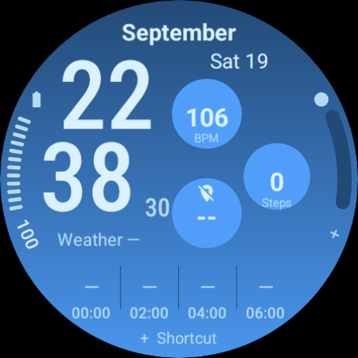

# Ultra Info Board

A resource-only Galaxy Watch / Wear OS face with a blue gradient, large stacked time, native weather, and six editable complication areas. The layout prioritizes readability on round displays; the artwork and weather glyphs here are original.

**Development milestone, not a store release.** Requires Wear OS 5 (API 34) or later. The working package is `com.example.ultrainfoboard`; choose the permanent publisher/package identity before the first store upload.



*Actual Wear OS emulator capture. Weather is unavailable on the emulator; readings come from its installed providers. See [captures and layout proofs](docs/previews/README.md) for always-on and illustrative weather views.*

## Layout

- Month and day/date above large hours/minutes; minutes shifted left with a larger separate seconds column.
- Three staggered circles on the right: heart rate, steps, sunrise/sunset by default.
- Segmented left battery gauge, thick right-edge arc, provider icons and angled edge labels. Right edge and bottom shortcut start unassigned.
- Larger current weather and four forecasts (+2, +4, +6, +8 hours), with icons, temperatures and local times. Tap the current reading or forecasts to open Samsung Weather on Galaxy Watch.
- Black always-on display with thin time and date; all other content is hidden.

Long-press the face and choose **Customize** to assign each slot. Providers available on a particular watch determine which data/apps can be selected. Samsung activity, stress, media and Gemini are not bundled or guaranteed providers. A `+` marks an unassigned area; assign it through the editor. Weather and health readings are never hard-coded; unavailable readings remain empty or show a dash. The face uses the system's weather data and temperature unit and follows 12/24-hour time preferences.

The weather shortcut targets the preinstalled Samsung Weather app (`com.samsung.android.watch.weather`). It is separate from the native weather data source. Other Wear OS brands and the stock emulator may not have this app; opening the actual Samsung app requires a physical Galaxy Watch check.

## Build and install

Install JDK 17, Android SDK command-line tools, platform 35 and build-tools 35.0.0. Set `ANDROID_HOME` or create ignored `local.properties` with `sdk.dir=/your/android/sdk`.

```sh
sdkmanager 'platforms;android-35' 'build-tools;35.0.0' 'platform-tools'
./gradlew :app:assembleDebug :app:bundleRelease
adb install -r app/build/outputs/apk/debug/app-debug.apk
adb shell am broadcast -a com.google.android.wearable.app.DEBUG_SURFACE \
  --es operation set-watchface --es watchFaceId com.example.ultrainfoboard
```

The debug APK is installable and signed with the development key. The release AAB is **unsigned**, for later release preparation. Both builds remove generated Android resource bytecode so no DEX is packaged. Do not enable resource shrinking: resources referenced in raw WFF XML must remain available.

CI runners generate temporary debug signing keys. If an update from a different runner fails with `INSTALL_FAILED_UPDATE_INCOMPATIBLE`, uninstall the earlier development build before installing the new one; this resets that build's watch-face settings. Stable release signing is a later milestone.

### Test a downloaded APK in Android Studio on Windows

1. In Android Studio's **Device Manager**, create and start a round Wear OS API 34 or API 35 virtual device.
2. Open the latest successful [GitHub Actions run](https://github.com/DylanMc25/ultrawatchfaceedits/actions/workflows/watchface.yml?query=branch%3Acodex%2Fwatchface-redesign) and download **watchface-build-and-reports** under **Artifacts**. Extract the ZIP and locate `app-debug.apk`.
3. Drag the APK onto the running emulator. This package is a watch face, so it has no normal app launch screen.
4. Long-press the current watch face, add **Ultra Info Board**, and select it. Long-press again and choose **Customize** or **Edit** to assign complications.

If installation reports mismatched signatures, run this in PowerShell while only one emulator is running, then drag the new APK onto it again:

```powershell
& "$env:LOCALAPPDATA\Android\Sdk\platform-tools\adb.exe" -e uninstall com.example.ultrainfoboard
```

Expect `Success`. Uninstalling resets this face's saved complication choices. The full path avoids the `adb is not recognized` error; if your SDK is elsewhere, use its location from Android Studio's SDK Manager.

For a physical Galaxy Watch, enable developer options and wireless debugging, then use `adb pair WATCH_IP:PAIRING_PORT` and `adb connect WATCH_IP:DEBUG_PORT` with the addresses shown on the watch. After installation, open the watch-face picker and add **Ultra Info Board**. The debug selection broadcast above is used by the emulator tests; use the picker if the watch does not honor it. All physical Galaxy Watch results remain pending.

## Edit and validate

`tools/generate_watchface.py` is the source of truth for the XML, geometry and five-color palette. It uses only Python's standard library. After editing:

```sh
python3 tools/generate_watchface.py
bash tools/validate.sh
```

Validation checks generated-file consistency, geometry/time regressions, Google's WFF 2 schema, Android lint/builds, code-free package contents and memory limits. Official validator downloads are SHA-256 checked; a changed upstream release requires a deliberate hash update. `WFF_TOOLS_DIR` can select an existing tools cache.

Weather icons are committed PNG resources. To redraw them, install Pillow and run `python3 tools/generate_weather_icons.py`. The app requires no Python runtime, API keys, server or companion app.

## CI and emulator checks

GitHub Actions uploads `watchface-build-and-reports` with APK, AAB and validation reports. Separate jobs install and render on large round API 34 and small round API 35 (Wear OS 5.1 uses the `android-35-ext15` image). Emulator artifacts contain installation/activation logs, 12/24-hour captures, ambient captures with DOZE/illumination checks, and editor/provider interaction diagnostics. These require visual review: a successful install alone is not visual validation, and editor automation records inconclusive results explicitly.

See [validation evidence](docs/VALIDATION.md) and the [release checklist](docs/RELEASE.md) for completed checks and remaining work.
