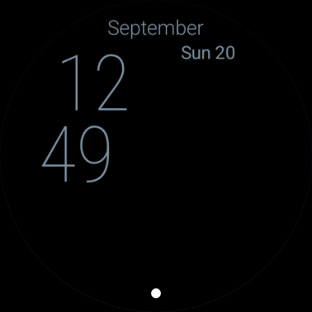

# Build blue stacked-time watch face with seven editable complications

Replaces the placeholder face with a blue gradient, large stacked time, three staggered circular complications, edge indicators and a bottom shortcut. A compact interchangeable weather slot replaces the separate current-weather/forecast grid. It accepts provider text, icons, images/charts and progress, and delegates taps to the selected provider. Heart rate, steps, sunrise/sunset and battery are default sources; weather, right edge and bottom shortcut start unassigned. Modest type increases keep the familiar layout. Black always-on mode retains thin time and date only.

Preserves resource-only WFF 2 packaging and stable slot IDs 1–6; adds slot 7. Restores the pinned Gradle wrapper and produces a debug APK and unsigned release AAB with no DEX. Adds GitHub build/schema/memory/lint checks, geometry regressions and two round Wear OS emulator jobs. Includes setup, installation and release documentation.

Validation: ten regression checks, official WFF syntax/resource and memory checks, builds and lint pass. Native capture provenance, individual chooser results, tap evidence and measured ambient illumination are recorded in [validation evidence](VALIDATION.md). An API 34 post-editor capture has a partial background redraw anomaly; initial active/editor captures and API 35 are clean. The cause is unresolved and recorded for reproduction. Samsung Weather and image/chart providers remain physical-device checks; the stock emulator tests the new slot with Alarm instead.

This is a development milestone. Physical Galaxy Watch verification, permanent branding/package identity, release signing and Play Store preparation remain required before sale.
