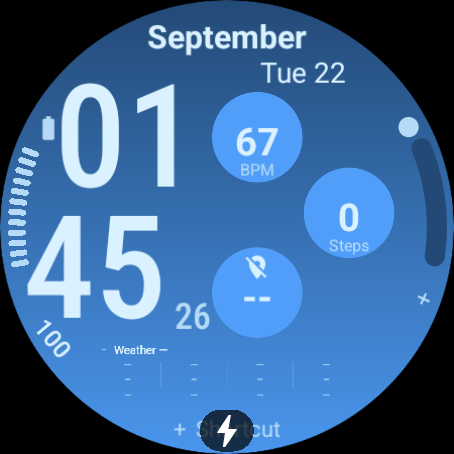
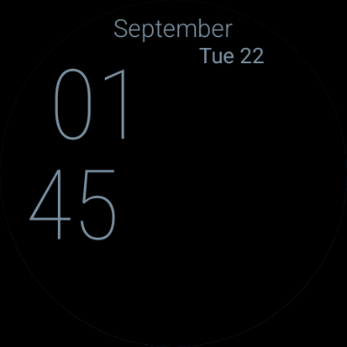
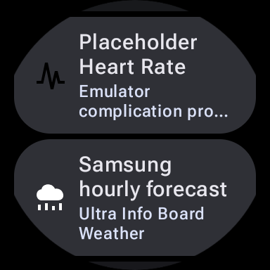
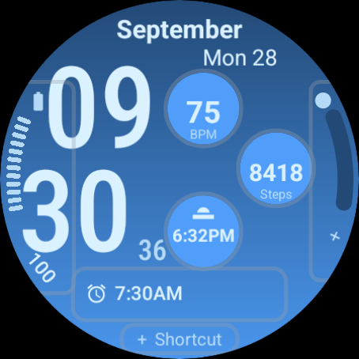
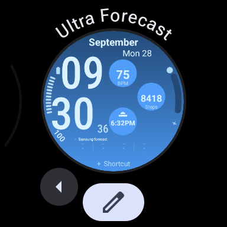
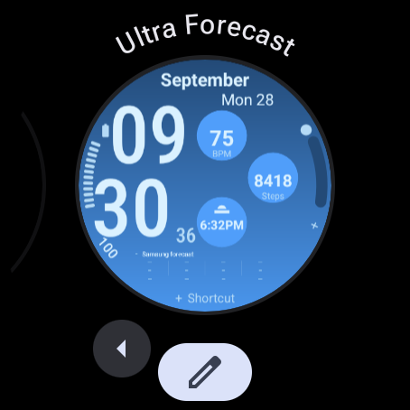

# Validation

## Current preview 0.2.0-preview.4 (version 11)

The installed face remains the layout baseline: two-line date, stacked time and three staggered circles. Month/date text is smaller, time is slightly smaller and inset, and live readings are larger. The forecast rectangle grows from 262 × 60 to 262 × 94 with larger temperatures, icons and hourly labels. Its source is now named **Weather**. The native picker accepts `LONG_TEXT`, `SMALL_IMAGE` and `EMPTY`; the OS decides which providers satisfy those formats. All seven slot IDs and provider component identities remain stable, but bounds have changed. The original standalone build is now 0.1.7 (version 8).

The user reconfirmed that weather works on their Galaxy Watch before this revision. This does not validate the new layout or the narrower picker on Samsung. Forecast comparison across units/location/refresh states, saved assignments after upgrade and physical readability remain device checks.

Local validation passes: **29 JVM tests**, **18 Python tests**, debug and test APKs, unsigned test AABs, Android lint, the official WFF 2 syntax/resource and standalone memory checks, and all **10 official Watch Face Push checks** on the signed embedded face. Four forecast timeline images plus one fallback use **492,560 bitmap bytes**, below 512 KiB; exact data-expiry boundaries are retained even when this shortens timeline coverage. No measurements here establish live Samsung access or visual correctness.

Native small/large API 36 and standalone API 34/35 checks are pending for version 11. They now select Battery in the rectangle, verify its settings tap, and restore our app's **Weather** through the ordinary chooser. Renderer fixtures include exact delivered 262 × 94 images as well as supersampled previews. The historical screenshots below belong to their named earlier versions.

## Version 10 Wear OS 6 evidence

The current implementation is a Wear OS 6 / API 36 host app with a bundled resource-only WFF 2 face and an ordinary replaceable rectangular forecast complication. The bundled face is named **Ultra Forecast** in preview 0.2.0-preview.3 (version code 10), distinct from the original standalone **Ultra Info Board**. Version 9's longer **Ultra Info Board Forecast** name was truncated in the round picker and is superseded. See [Samsung preview installation and checks](SAMSUNG_FORECAST_TESTING.md) and [bundle architecture](WATCH_FACE_PUSH_PLAN.md).

**Physical Galaxy Watch report:** the user confirmed that the new forecast displays Samsung weather data and that tapping it opens Samsung Weather. This is physical evidence for the data/tap path. It does not yet establish exact agreement across every hour, temperature unit, location, update state, or weather condition. The user still reported difficulty selecting it as a normal complication; that acceptance item remains unresolved. Physical testing was paused for the evening.

### Local validation

The latest local checks passed: **28 JVM tests**, **18 Python tests**, host debug APK / unsigned release AAB builds and lint, plus all **10 checks in the official Watch Face Push validator** for the bundled APK. The latter includes WFF syntax/resources, memory, manifest/package restrictions, and APK signing. Bundle preparation validates the final signed face and embeds its corresponding token. These checks cannot prove Samsung runtime behavior or editor usability.

Coverage includes Samsung payload parsing, missing/stale and denied data, units and local-hour selection, bounded forecast timeline transitions, original complication/tap geometry, seven stable slots, generated-bundle isolation, and rejecting a validator with an unexpected hash. The six original complication definitions and all seven touch rectangles remain unchanged; the bottom image fills its existing 262 × 60 area.

### Native Wear OS 6 evidence

[Run 35676584438](https://github.com/DylanMc25/ultrawatchfaceedits/actions/runs/35676584438), source `1b03299`, passed both API 36 emulator smoke jobs, with eight Android instrumentation tests passing on each. Captures and installation evidence were downloaded and reviewed. Both `default-face-before-launch.txt` records contain the prefixed bundled face package, confirming automatic installation before the host's first launch.

| API 36 smoke evidence | Large round | Small round |
| --- | --- | --- |
| Capture dimensions | 454 × 454 | 384 × 384 |
| Active blue face | Renders; weather honestly unavailable | Renders; weather honestly unavailable |
| Ambient | Black time/date only, DOZE | Black time/date only, DOZE |
| Lit pixels, including system overlays | 7,707 / 161,892 (4.7606%) | 5,555 / 115,816 (4.7964%) |

Active/ambient screens and three explicitly labelled forecast-fixture images fit their bounds. Fixture images are sample-rendering tests, not Samsung observations. A system charging overlay partially obscures the bottom Shortcut. These captured ambient states are below the [15% limit](https://developer.android.com/training/wearables/wff/ambient); other time/date combinations and physical AOD remain separate checks.

Recorded evidence: [API 36 smoke report](validation/forecast-api36-smoke.json), [large setup screen](previews/forecast/api36-large-setup.png), [small setup screen](previews/forecast/api36-small-setup.png).

[Saved-data fixture](previews/forecast/forecast-fixture-saved-blue.png), [partial-data fixture](previews/forecast/forecast-fixture-partial-blue.png), and [night fixture](previews/forecast/forecast-fixture-night-black.png) are explicitly synthetic renderer checks.

Manual log review found correct custom-provider registration and `SMALL_IMAGE` delivery, with no application/provider crash, failed WFF expression, or forecast bitmap/Binder error. Both stock API 36 images did log a vendor sensor-service crash on entering ambient (`unexpected sensor type: 26`). The captured displays reached DOZE and the pixel measurements above remain image evidence; these emulators do not establish physical sensor or power behavior.

This run did **not** exercise ordinary provider selection, replacing the rectangle with another app, or restoring the forecast through the native editor. Stock emulators do not contain Samsung Weather and cannot verify that connection.

[Run 35677046105](https://github.com/DylanMc25/ultrawatchfaceedits/actions/runs/35677046105), source `b864c30` / version 9, **passed native editor selection on both sizes**. Artifacts and screenshots were reviewed. Each run opens the actual provider chooser, assigns Alarm, reopens the editor to verify persistence, confirms all three rectangle taps open Clock's Alarm screen, opens setup without overwriting Alarm, then finds and selects **Samsung hourly forecast** through the ordinary provider list. Reopening the editor confirms that selection, and all three taps open setup because Samsung Weather is absent. The [editor evidence](validation/forecast-api36-editor.json) records the actual resumed activities, not only internal slot dispatch. Ambient rechecks were 4.8427% large / 4.8888% small, both DOZE. Eight Android tests passed on each device.

The same captures exposed a presentation defect: **Ultra Info Board Forecast** was truncated to **Ultra Info Boa…**, hiding the new name's distinguishing word. Version 10 shortens the picker label to **Ultra Forecast** without changing the package, slots, data source or selection logic. The physical Samsung editor issue remains unresolved even though the ordinary stock Wear OS editor passes.

**Final version 10 confirmation:** [run 35677889561](https://github.com/DylanMc25/ultrawatchfaceedits/actions/runs/35677889561), source `e9fe68d`, passed the build and both emulator jobs. Both complete native selection/replacement/restoration tests pass again, as do eight Android tests per device and 28 JVM tests. The full **Ultra Forecast** title is visibly readable on both round pickers without an ellipsis. Final ambient captures are DOZE, **5.2127%** large and **4.6902%** small, below 15%. See [version 10 results](validation/forecast-api36-v10.json), [large active](previews/forecast/api36-large-active-v10.png), [small active](previews/forecast/api36-small-active-v10.png), [large ambient](previews/forecast/api36-large-ambient-v10.png), and [small ambient](previews/forecast/api36-small-ambient-v10.png).

### Original standalone layout regression

[Run 35675092050](https://github.com/DylanMc25/ultrawatchfaceedits/actions/runs/35675092050), source `6f2fa6d`, passed validation and both API 34/35 jobs. Its artifact archives were downloaded, their SHA-256 hashes verified, and active/ambient plus Alarm-assignment captures visually reviewed. These are regression results for the original standalone `:app`, **not** the new bundled forecast face. See the [standalone evidence record](validation/standalone-6f2fa6d.json).

| Check | API 34 large round | API 35-ext15 small round |
| --- | --- | --- |
| Capture dimensions | 454 × 454 | 384 × 384 |
| Time/date, circles and edge captions | Visible without clipping | Visible without clipping |
| All seven provider choosers | Opened | Opened |
| Rectangle reassigned to Alarm | Confirmed | Confirmed |
| Rectangle left/center/right taps | Slot 7 throughout | Slot 7 throughout |
| Black ambient, time/date only | DOZE confirmed | DOZE confirmed |
| Non-black round-screen pixels, including system overlays | 4.6988% | 4.4882% |

These captured ambient states are below the documented 15% limit; they do not cover every time/date. API 35's system dot and its active-state background obscure part of the bottom Shortcut; this is distinct from clipping of face content. Heart-rate taps recorded no provider launch, so successful heart-rate app opening is unverified. Both 12/24-hour captures show an hour of 01; they do not demonstrate noon/midnight conversion. Samsung Weather is absent and the rectangle was exercised with Alarm only.

### Remaining acceptance checks

- Confirm the normal editor flow on the Galaxy Watch when physical testing resumes; stock API 36 provider replacement/restoration and version 10's shortened picker name now pass.
- Compare the forecast against Samsung Weather across location, units, hourly rollover, stale/missing data and permission changes. Confirm one whole-area Samsung Weather tap and provider-owned taps after replacement.
- Check selections across Setup launches, consistently signed upgrades and reboot. An uninstall/reinstall is not a settings-preservation test.
- Review physical readability, system overlays, AOD and battery use. Confirm Samsung interface support/commercial suitability before release.

Everything below is **historical evidence for the named earlier versions**. Earlier panel menus, native-weather failures, screenshots and pending checklists do not describe the current Wear OS 6 Samsung-cache provider.

---

## Historical standalone 0.1.6: app-selectable bottom rectangle

The user clarified that the bottom rectangle must accept other apps' complications. This version restores standard editable slot 7, removes the curated native panel menu, and preserves slots 1–6 byte-for-byte. The rectangle retains its 262 × 60 footprint without a heavy background. Samsung's public Weather service is the preferred LONG_TEXT default with EMPTY fallback; the chosen provider owns data and taps.

Physical report for **0.1.5** (2026-09-21): the native panel showed `Weather —`; its tap opened Samsung Weather, where the user confirmed current location and real hourly forecasts. The native data integration is therefore not working on that test watch. This is recorded as a failure, not a successful forecast test. Version 0.1.6's provider integration requires a new physical test.

### Validation recorded for standalone 0.1.6

Local validation passes: 13 regression/fixture checks, official WFF 2 syntax/resources, debug APK, unsigned release AAB, Android lint, resource-only package checks and official memory validation. Maximum active memory is 2,371,712 bytes; ambient is 3,181,712 bytes. Native emulator checks were pending at this checkpoint; the later standalone regression run is recorded above. Those captures do not establish Samsung compatibility. Regression checks cover all seven complete renderers, separate tap regions, provider text/units/missing text, progress boundaries, unchanged time/circles and time/date-only ambient. The emulator script selects Alarm for slot 7 and checks provider dispatch at the left, center and right of the rectangle.

Follow [PHYSICAL_TEST.md](PHYSICAL_TEST.md) to select Weather, replace it with a different app, check persistence/tap destinations, and test an image/chart provider. Samsung's public Weather exposes current conditions, not Info Brick's private hourly chart.

## Historical 0.1.5 curated panel

### 0.1.5 local and fixture checks

Local validation (2026-09-19): 18 regression/fixture checks; official WFF 2 syntax/resources; debug APK; unsigned release AAB; Android lint; no-DEX/signing/package checks; and official memory checks all pass. Maximum active memory is 2,371,712 bytes and maximum ambient memory is 3,181,712 bytes, below the configured limits. The memory validator measures supported WFF resources; it does not prove visual correctness or runtime data access.

The new menu, missing/stale data, partial forecasts, Celsius/Fahrenheit extremes, flat/missing temperature trends, zero/empty/out-of-range health readings, all weather condition codes, None, 12/24-hour labels, midnight/noon and daylight-saving changes are exercised against the generated XML. Fixture expression evaluation models WFF behavior using Node and is not a replacement for native runtime tests.

The six pre-existing complication XML definitions were compared against 0.1.4 and are unchanged. Slot 7 is removed and replaced with the Bottom panel editor setting. Physical-watch upgrade persistence of slots 1–6 still requires checking with a consistently signed update; uninstall/reinstall resets settings by design.

Initial native run [35483336158](https://github.com/DylanMc25/ultrawatchfaceedits/actions/runs/35483336158), source `2137a84997f853733081945b89a35abc6f38904f`: API 34 large round (454 px) and API 35 small round (384 px) passed install/render, 12/24-hour, six provider choosers, edge Alarm assignment and boundary-tap dispatch checks. The Bottom panel page displays Weather. This run predates the zero-step availability fix and does not yet establish switching/persistence for all seven panels.

Both ambient captures have confirmed DOZE state: API 34 **4.6235%**, API 35 **4.9846%** lit pixels including system overlays. Neither has panel/gradient content in ambient. Native active screens honestly show weather unavailable on these unpaired emulators. The editor supplies its own illustrative weather values; those are not live weather verification. The API 35 system status indicator still overlaps the bottom shortcut, an existing physical-device review item.

The old provider heart-rate sample emits no tap launch event; other expected provider dispatches were observed, with no wrong-slot launches. Do not interpret absence of a wrong launch as a successful heart-rate app launch. Older results in the historical section apply only to their named revisions.

### Historical 0.1.5 native chart correction

Expanded run [35483891344](https://github.com/DylanMc25/ultrawatchfaceedits/actions/runs/35483891344), source `6d82a1a953c6b8a509c941d2ecc36d1277979ac6`, completed all seven panel choices and persistence checks on both APIs. Each weather/Steps tap reached its package target exactly once at left/center/right; absent Samsung apps produced market-fallback events, not successful Samsung app launches. None produced no events. The heart-rate system shortcut had no launch event on these stock images and remains unverified on Galaxy Watch.

**Manual log review caught a Temperature-chart defect despite the green workflow:** `min()` and `max()` in Transform expressions passed the syntax validator but failed in both native runtimes. The chart is corrected to use supported `clamp()` expressions, fixture evaluation no longer supplies unsupported functions, and CI now fails on native `DWF:Expression ... failed` messages after exercising all panels. The earlier green run must not be treated as a working Temperature chart. Corrected native results will be recorded after the rerun.

Native health fields on stock emulators returned zero steps, unavailable goal and unavailable heart rate even while separate mock complication providers supplied readings. The new panels handle those values explicitly; they do not borrow or fabricate readings from the mock providers. Physical health access, goal availability and Samsung app destinations remain required checks.

### Archived 0.1.5 physical checklist — superseded by the Wear OS 6 preview

1. Install the debug APK, choose Ultra Info Board, open Customize → Bottom panel, and try all seven options. Return to the face and re-open the editor to confirm the chosen option persists.
2. Confirm Weather has real current conditions and four consecutive hourly entries. Check temperature units and 12/24-hour preference. Missing data must show dashes, not sample values. An exclamation mark means a refresh failed while cached data remains available.
3. Tap the left, center and right of the panel: each weather view should open Samsung Weather exactly once. None must have no action. Steps should open Samsung Health; Heart rate uses the system heart-rate destination.
4. Check missing weather/location and health access denied, then restore access. Native WFF supplies no independent steps permission flag; if the runtime supplies zero, zero is displayed. Compare native counts/readings with Samsung Health without assuming both data sources match.
5. Confirm all six ordinary complication areas still select and launch their own providers, including near boundaries. With a consistently signed upgrade from 0.1.4, verify IDs 1–6 retain selections; the former rectangle assignment is intentionally replaced.
6. Check readability, midnight/noon, weather hour rollover and real AOD on the physical display. Samsung native weather access and app launches cannot be proved by stock emulator captures.

## Historical validation (earlier revisions)

### 0.1.4 validation evidence

Version 0.1.4, 2026-09-19. Resource-only WFF 2; Temurin JDK 17, Gradle 8.13, AGP 8.13.2, Android platform/build-tools 35.

### Historical 0.1.4 local checks

| Check | Result |
| --- | --- |
| Generated XML matches generator | Pass |
| Ten geometry/complication regression checks | Pass |
| Official WFF validator 1.7.0, format 2 | Pass |
| Debug APK / unsigned release AAB / Android lint | Pass |
| Package resources and absence of DEX | Pass |
| Official APK/AAB memory evaluator | Pass: active 2,371,712 bytes; ambient 3,181,712 bytes |

Regression coverage includes all seven named slots and renderers, non-overlapping editor bounds and runtime slot rectangles, bounded rendering parts, complete rotated edge labels and gauge clearance, separated minutes/seconds, time/circle clearance, device time-format synchronization, and time/date-only ambient visibility. The weather-slot contract rejects any hard-coded app launch or native forecast data: the selected complication provider owns its data and tap action. It also checks short/long text, images and progress support. There are no longer any forecast rollover expressions to test.

The layout retains the previous stacked time and three staggered circles. Hours/minutes increase from 126 to 142 units, seconds from 32 to 36, and the three circles to 90 units. Readings of up to three characters increase to 38; four- and five-character values use 30, and longer text uses 22. Month/date, edge readings, gauge strokes and the bottom shortcut are also larger. The left battery caption moves lower to clear the wider minutes. Slot 7 remains exactly 262 × 60 below the main readings, as requested. Slot IDs 1–6 are preserved. Weather starts empty because WFF has no portable system WEATHER provider; choose an installed source in Customize. Image providers may use the area for a chart, but the face does not generate chart history. The basic Weather card still does not reproduce Samsung Info Brick’s hourly forecast; [provider investigation](SAMSUNG_WEATHER.md) records the physical-watch diagnostics and inspection of the supplied Weather and Info Brick APKs. Info Brick draws its hourly panel from a Samsung content-provider model; the public Weather complication sends current conditions only.

Lint advisories include available dependency updates, resource references inside raw WFF that lint cannot trace, and backup metadata for a code-free package. Resource shrinking remains disabled. `validation/package-checksums.json` identifies local deliverables; CI APK checksums differ because its debug signing keys are temporary.

### Historical 0.1.4 native emulator evidence

[GitHub run 35481758095](https://github.com/DylanMc25/ultrawatchfaceedits/actions/runs/35481758095), source commit `eea5ffb`, passed the build job and both emulator jobs. Captures were downloaded and visually reviewed.

| Check | API 34, 454 × 454 | API 35-ext15, 384 × 384 |
| --- | --- | --- |
| Install, activate and render blue face | Pass | Pass |
| Device 12/24-hour preference | Pass | Pass |
| Native editor: all seven provider choosers | Pass | Pass |
| Weather-area reassignment to Alarm | Pass | Pass |
| Assigned weather-area tap dispatches slot 7 | Pass | Pass |
| Circle-boundary taps between neighboring slots | Pass | Pass |
| Wrong complication dispatch | None | None |
| Angled battery and assigned right-edge text | Visible | Visible |
| Black time/date-only ambient, display state | DOZE | DOZE |
| Ambient lit pixels, including overlays | 3.3819% | 5.0986% |

The native editor's four-digit step count is shown in full with the compact numeric size. Larger stacked digits, seconds, circle readings and angled captions were visually reviewed on both display sizes. The empty weather panel and the assigned Alarm panel both render within their bounds. The earlier API 34 partial-background redraw anomaly was not reproduced in this run: active and assigned-provider backgrounds render fully. Its cause remains unknown, so retain a physical-device regression check. API 35's system status overlays cover part of the bottom shortcut; this is still a physical-device review item.

Steps, sunrise/sunset, battery and the assigned weather slot dispatch to IDs 2, 3, 4 and 7 respectively. Battery opens native Battery settings. The emulator's heart-rate provider emits no tap launch at its center or boundary; these probes establish no wrong-slot dispatch, not a successful heart-rate app launch. Real health/app destinations remain unverified.

The intermediate corrected-layout run `35481411856` stopped at an outdated screenshot smoke check: its old sample positions were covered by the enlarged circle and weather panel. Both captured active faces rendered correctly. The smoke check now samples exposed background and was checked against those active images and an ambient image (which it correctly rejects).

A preliminary enlarged layout (`6759277`, [run 35480895592](https://github.com/DylanMc25/ultrawatchfaceedits/actions/runs/35480895592)) exposed a native hit-testing issue: API 35 routed taps from the upper circle to slot 2 and from the middle circle to slot 3 where the slot rectangles overlapped. The visible ovals were separate. The corrected layout keeps the enclosing rectangles separate too; circle-boundary probes remain in the native test. This is why geometric oval separation alone is not accepted as validation.

The local host lacks `/dev/kvm`; software-emulated Android startup previously hit system-server watchdog failures. Native evidence therefore comes from hardware-accelerated GitHub emulators, not the illustrative renderer.

The automation opens all seven native provider choosers independently. It assigns Alarm to the right edge to check the angled label, then assigns Alarm to the weather area to exercise an actual provider selection and tap. The stock emulator does not include Samsung Weather. An Alarm test establishes the interchangeable slot contract; it does **not** establish live Samsung Weather, chart-provider rendering, or Samsung app launches.

The editor displays Wear OS sample time/health readings, not live measurements. Active health values come from emulator providers. Empty/unavailable data is never replaced with fabricated readings by the face. The illustrative preview uses explicitly supplied sample weather.

Ambient illumination counts every non-black pixel inside the circular screen, including system indicators. The [15% limit](https://developer.android.com/training/wearables/wff/ambient) applies; measurements establish only the captured time/date/device, not every possible state. The emulator simulates an unplugged battery to avoid the charging overlay. Wear OS status indicators may still overlay the bottom shortcut.

### Archived 0.1.4 physical-device coverage

- Check for the recorded API 34 background redraw anomaly after changing providers, including returning from the editor and crossing a minute boundary.
- Choose Weather in the new slot on the user's Galaxy Watch, check permissions, live readings, units, unavailable state and the provider's tap destination.
- Assign a compatible image/chart provider and inspect its aspect ratio and readability. This is not guaranteed for every third-party provider.
- Check long localized month/day strings, wide digits, large steps and provider text, midnight/noon, time-zone changes and temperature extremes.
- Check real heart-rate consent/actions, provider settings persistence across updates/reboots and battery consumption.
- Review ambient legibility and illumination at other times/dates on Galaxy Watch hardware.

The previous layout's physical user feedback informed the revision, but the revised layout is not yet verified on a physical Galaxy Watch. See [release prerequisites](RELEASE.md) before selling.

### Historical preview status

`docs/previews/*-illustrative.png` are approximate layout proofs from WFF geometry and explicit sample data. They do not prove native font metrics, provider compatibility or battery behavior. The active illustration is the temporary system picker preview; use verified device screenshots before publishing.
