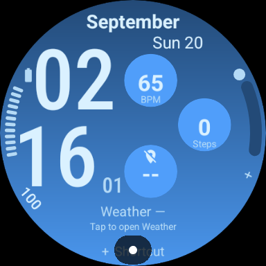

# Current milestone: 0.1.6 app-selectable bottom rectangle

The user clarified that the bottom rectangle must accept other apps' complications. This version restores standard editable slot 7, removes the curated native panel menu, and preserves slots 1–6 byte-for-byte. The rectangle retains its 262 × 60 footprint without a heavy background. Samsung's public Weather service is the preferred LONG_TEXT default with EMPTY fallback; the chosen provider owns data and taps.

Physical report for **0.1.5** (2026-09-21): the native panel showed `Weather —`; its tap opened Samsung Weather, where the user confirmed current location and real hourly forecasts. The native data integration is therefore not working on that test watch. This is recorded as a failure, not a successful forecast test. Version 0.1.6's provider integration requires a new physical test.

## Current validation

Local validation passes: 13 regression/fixture checks, official WFF 2 syntax/resources, debug APK, unsigned release AAB, Android lint, resource-only package checks and official memory validation. Maximum active memory is 2,371,712 bytes; ambient is 3,181,712 bytes. Native emulator checks are being rerun for 0.1.6. No earlier screenshot establishes this revision's appearance or Samsung compatibility. Regression checks cover all seven complete renderers, separate tap regions, provider text/units/missing text, progress boundaries, unchanged time/circles and time/date-only ambient. The emulator script selects Alarm for slot 7 and checks provider dispatch at the left, center and right of the rectangle.

Follow [PHYSICAL_TEST.md](PHYSICAL_TEST.md) to select Weather, replace it with a different app, check persistence/tap destinations, and test an image/chart provider. Samsung's public Weather exposes current conditions, not Info Brick's private hourly chart.

## Historical 0.1.5 curated panel

# 0.1.5 validation history

Local validation (2026-09-19): 18 regression/fixture checks; official WFF 2 syntax/resources; debug APK; unsigned release AAB; Android lint; no-DEX/signing/package checks; and official memory checks all pass. Maximum active memory is 2,371,712 bytes and maximum ambient memory is 3,181,712 bytes, below the configured limits. The memory validator measures supported WFF resources; it does not prove visual correctness or runtime data access.

The new menu, missing/stale data, partial forecasts, Celsius/Fahrenheit extremes, flat/missing temperature trends, zero/empty/out-of-range health readings, all weather condition codes, None, 12/24-hour labels, midnight/noon and daylight-saving changes are exercised against the generated XML. Fixture expression evaluation models WFF behavior using Node and is not a replacement for native runtime tests.

The six pre-existing complication XML definitions were compared against 0.1.4 and are unchanged. Slot 7 is removed and replaced with the Bottom panel editor setting. Physical-watch upgrade persistence of slots 1–6 still requires checking with a consistently signed update; uninstall/reinstall resets settings by design.

Initial native run [35483336158](https://github.com/DylanMc25/ultrawatchfaceedits/actions/runs/35483336158), source `2137a84997f853733081945b89a35abc6f38904f`: API 34 large round (454 px) and API 35 small round (384 px) passed install/render, 12/24-hour, six provider choosers, edge Alarm assignment and boundary-tap dispatch checks. The Bottom panel page displays Weather. This run predates the zero-step availability fix and does not yet establish switching/persistence for all seven panels.

Both ambient captures have confirmed DOZE state: API 34 **4.6235%**, API 35 **4.9846%** lit pixels including system overlays. Neither has panel/gradient content in ambient. Native active screens honestly show weather unavailable on these unpaired emulators. The editor supplies its own illustrative weather values; those are not live weather verification. The API 35 system status indicator still overlaps the bottom shortcut, an existing physical-device review item.

The old provider heart-rate sample emits no tap launch event; other expected provider dispatches were observed, with no wrong-slot launches. Do not interpret absence of a wrong launch as a successful heart-rate app launch. Older results in the historical section apply only to their named revisions.

## Native chart correction

Expanded run [35483891344](https://github.com/DylanMc25/ultrawatchfaceedits/actions/runs/35483891344), source `6d82a1a953c6b8a509c941d2ecc36d1277979ac6`, completed all seven panel choices and persistence checks on both APIs. Each weather/Steps tap reached its package target exactly once at left/center/right; absent Samsung apps produced market-fallback events, not successful Samsung app launches. None produced no events. The heart-rate system shortcut had no launch event on these stock images and remains unverified on Galaxy Watch.

**Manual log review caught a Temperature-chart defect despite the green workflow:** `min()` and `max()` in Transform expressions passed the syntax validator but failed in both native runtimes. The chart is corrected to use supported `clamp()` expressions, fixture evaluation no longer supplies unsupported functions, and CI now fails on native `DWF:Expression ... failed` messages after exercising all panels. The earlier green run must not be treated as a working Temperature chart. Corrected native results will be recorded after the rerun.

Native health fields on stock emulators returned zero steps, unavailable goal and unavailable heart rate even while separate mock complication providers supplied readings. The new panels handle those values explicitly; they do not borrow or fabricate readings from the mock providers. Physical health access, goal availability and Samsung app destinations remain required checks.

## Physical Galaxy Watch acceptance checklist — pending

1. Install the debug APK, choose Ultra Info Board, open Customize → Bottom panel, and try all seven options. Return to the face and re-open the editor to confirm the chosen option persists.
2. Confirm Weather has real current conditions and four consecutive hourly entries. Check temperature units and 12/24-hour preference. Missing data must show dashes, not sample values. An exclamation mark means a refresh failed while cached data remains available.
3. Tap the left, center and right of the panel: each weather view should open Samsung Weather exactly once. None must have no action. Steps should open Samsung Health; Heart rate uses the system heart-rate destination.
4. Check missing weather/location and health access denied, then restore access. Native WFF supplies no independent steps permission flag; if the runtime supplies zero, zero is displayed. Compare native counts/readings with Samsung Health without assuming both data sources match.
5. Confirm all six ordinary complication areas still select and launch their own providers, including near boundaries. With a consistently signed upgrade from 0.1.4, verify IDs 1–6 retain selections; the former rectangle assignment is intentionally replaced.
6. Check readability, midnight/noon, weather hour rollover and real AOD on the physical display. Samsung native weather access and app launches cannot be proved by stock emulator captures.

## Historical validation (earlier revisions)

# Validation evidence

Version 0.1.4, 2026-09-19. Resource-only WFF 2; Temurin JDK 17, Gradle 8.13, AGP 8.13.2, Android platform/build-tools 35.

## Local checks

| Check | Result |
| --- | --- |
| Generated XML matches generator | Pass |
| Ten geometry/complication regression checks | Pass |
| Official WFF validator 1.7.0, format 2 | Pass |
| Debug APK / unsigned release AAB / Android lint | Pass |
| Package resources and absence of DEX | Pass |
| Official APK/AAB memory evaluator | Pass: active 2,371,712 bytes; ambient 3,181,712 bytes |

Regression coverage includes all seven named slots and renderers, non-overlapping editor bounds and runtime slot rectangles, bounded rendering parts, complete rotated edge labels and gauge clearance, separated minutes/seconds, time/circle clearance, device time-format synchronization, and time/date-only ambient visibility. The weather-slot contract rejects any hard-coded app launch or native forecast data: the selected complication provider owns its data and tap action. It also checks short/long text, images and progress support. There are no longer any forecast rollover expressions to test.

The layout retains the previous stacked time and three staggered circles. Hours/minutes increase from 126 to 142 units, seconds from 32 to 36, and the three circles to 90 units. Readings of up to three characters increase to 38; four- and five-character values use 30, and longer text uses 22. Month/date, edge readings, gauge strokes and the bottom shortcut are also larger. The left battery caption moves lower to clear the wider minutes. Slot 7 remains exactly 262 × 60 below the main readings, as requested. Slot IDs 1–6 are preserved. Weather starts empty because WFF has no portable system WEATHER provider; choose an installed source in Customize. Image providers may use the area for a chart, but the face does not generate chart history. The basic Weather card still does not reproduce Samsung Info Brick’s hourly forecast; [provider investigation](SAMSUNG_WEATHER.md) records the physical-watch diagnostics and inspection of the supplied Weather and Info Brick APKs. Info Brick draws its hourly panel from a Samsung content-provider model; the public Weather complication sends current conditions only.

Lint advisories include available dependency updates, resource references inside raw WFF that lint cannot trace, and backup metadata for a code-free package. Resource shrinking remains disabled. `validation/package-checksums.json` identifies local deliverables; CI APK checksums differ because its debug signing keys are temporary.

## Native emulator evidence

[GitHub run 35481758095](https://github.com/DylanMc25/ultrawatchfaceedits/actions/runs/35481758095), source commit `eea5ffb`, passed the build job and both emulator jobs. Captures were downloaded and visually reviewed.

| Check | API 34, 454 × 454 | API 35-ext15, 384 × 384 |
| --- | --- | --- |
| Install, activate and render blue face | Pass | Pass |
| Device 12/24-hour preference | Pass | Pass |
| Native editor: all seven provider choosers | Pass | Pass |
| Weather-area reassignment to Alarm | Pass | Pass |
| Assigned weather-area tap dispatches slot 7 | Pass | Pass |
| Circle-boundary taps between neighboring slots | Pass | Pass |
| Wrong complication dispatch | None | None |
| Angled battery and assigned right-edge text | Visible | Visible |
| Black time/date-only ambient, display state | DOZE | DOZE |
| Ambient lit pixels, including overlays | 3.3819% | 5.0986% |

The native editor's four-digit step count is shown in full with the compact numeric size. Larger stacked digits, seconds, circle readings and angled captions were visually reviewed on both display sizes. The empty weather panel and the assigned Alarm panel both render within their bounds. The earlier API 34 partial-background redraw anomaly was not reproduced in this run: active and assigned-provider backgrounds render fully. Its cause remains unknown, so retain a physical-device regression check. API 35's system status overlays cover part of the bottom shortcut; this is still a physical-device review item.

Steps, sunrise/sunset, battery and the assigned weather slot dispatch to IDs 2, 3, 4 and 7 respectively. Battery opens native Battery settings. The emulator's heart-rate provider emits no tap launch at its center or boundary; these probes establish no wrong-slot dispatch, not a successful heart-rate app launch. Real health/app destinations remain unverified.

The intermediate corrected-layout run `35481411856` stopped at an outdated screenshot smoke check: its old sample positions were covered by the enlarged circle and weather panel. Both captured active faces rendered correctly. The smoke check now samples exposed background and was checked against those active images and an ambient image (which it correctly rejects).

A preliminary enlarged layout (`6759277`, [run 35480895592](https://github.com/DylanMc25/ultrawatchfaceedits/actions/runs/35480895592)) exposed a native hit-testing issue: API 35 routed taps from the upper circle to slot 2 and from the middle circle to slot 3 where the slot rectangles overlapped. The visible ovals were separate. The corrected layout keeps the enclosing rectangles separate too; circle-boundary probes remain in the native test. This is why geometric oval separation alone is not accepted as validation.

The local host lacks `/dev/kvm`; software-emulated Android startup previously hit system-server watchdog failures. Native evidence therefore comes from hardware-accelerated GitHub emulators, not the illustrative renderer.

The automation opens all seven native provider choosers independently. It assigns Alarm to the right edge to check the angled label, then assigns Alarm to the weather area to exercise an actual provider selection and tap. The stock emulator does not include Samsung Weather. An Alarm test establishes the interchangeable slot contract; it does **not** establish live Samsung Weather, chart-provider rendering, or Samsung app launches.

The editor displays Wear OS sample time/health readings, not live measurements. Active health values come from emulator providers. Empty/unavailable data is never replaced with fabricated readings by the face. The illustrative preview uses explicitly supplied sample weather.

Ambient illumination counts every non-black pixel inside the circular screen, including system indicators. The [15% limit](https://developer.android.com/training/wearables/wff/ambient) applies; measurements establish only the captured time/date/device, not every possible state. The emulator simulates an unplugged battery to avoid the charging overlay. Wear OS status indicators may still overlay the bottom shortcut.

## Remaining physical-device coverage

- Check for the recorded API 34 background redraw anomaly after changing providers, including returning from the editor and crossing a minute boundary.
- Choose Weather in the new slot on the user's Galaxy Watch, check permissions, live readings, units, unavailable state and the provider's tap destination.
- Assign a compatible image/chart provider and inspect its aspect ratio and readability. This is not guaranteed for every third-party provider.
- Check long localized month/day strings, wide digits, large steps and provider text, midnight/noon, time-zone changes and temperature extremes.
- Check real heart-rate consent/actions, provider settings persistence across updates/reboots and battery consumption.
- Review ambient legibility and illumination at other times/dates on Galaxy Watch hardware.

The previous layout's physical user feedback informed the revision, but the revised layout is not yet verified on a physical Galaxy Watch. See [release prerequisites](RELEASE.md) before selling.

## Preview status

`docs/previews/*-illustrative.png` are approximate layout proofs from WFF geometry and explicit sample data. They do not prove native font metrics, provider compatibility or battery behavior. The active illustration is the temporary system picker preview; use verified device screenshots before publishing.
