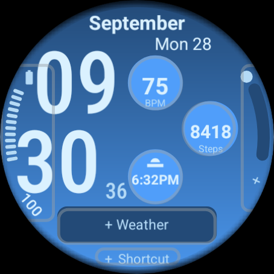

# Emulator captures and layout proofs

`emulator-api34-active.png` / `emulator-api34-ambient.png` are native 454 × 454 large-round captures. The API 35 pair is the 384 × 384 small-round Wear OS 5.1 emulator. See [validation evidence](../VALIDATION.md) for the source run, ambient illumination and limitations.

## Editor and provider interactions

The `*-editor.png` images show the real Wear OS editor and its **system sample time/health readings**. All seven outlined areas must independently open their provider chooser. `*-shortcut-picker.png` shows the bottom shortcut chooser; `*-weather-picker.png` shows the new interchangeable weather slot. Battery action captures record the native Battery settings page.

`*-edge-alarm.png` assigns Alarm to the right edge on disposable emulators to verify the angled “Set” label. `*-weather-assigned.png` assigns Alarm to the weather slot to verify it accepts another provider. These assignments are test fixtures; the APK leaves both slots unassigned. Samsung Weather and third-party chart providers require physical-watch checks. The prior API 34 partial-background redraw anomaly was not reproduced in the latest run. API 35 system status overlays can cover the bottom shortcut. Both limitations remain in the validation report.

## Illustrative layout

`active-illustrative.png` and `ambient-illustrative.png` are **illustrations, not emulator screenshots**. They use the committed WFF geometry and explicit sample data: September 19, 02:26, 71 bpm, 8,420 steps, 62% battery and sunny 24° weather. Actual readings always come from selected providers.

Generate with `tools/render_preview.py --font /path/to/Roboto-Regular.ttf` (Pillow and Node required). Text placement approximates WFF. The active illustration also serves as the temporary picker preview.

