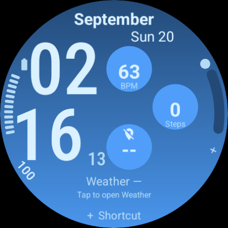
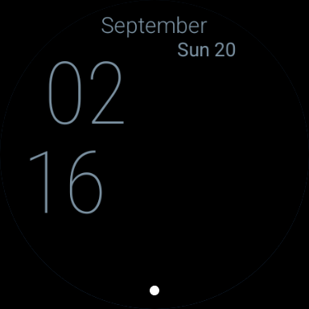
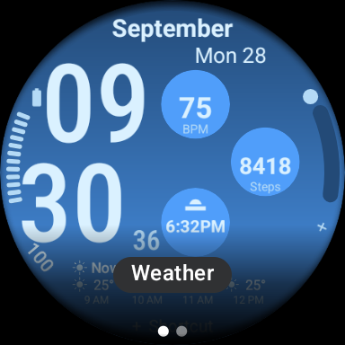
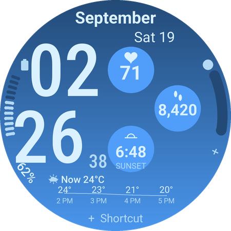

# Watch-face previews and test captures

## Current 0.1.6 rectangle

`active-illustrative.png` and the packaged preview show sample provider text in the transparent bottom rectangle. They are illustrations, not native screenshots or live Samsung Weather evidence. `ambient-illustrative.png` retains only time/date. The seven `panel-*-illustrative.png` files below are historical 0.1.5 menu options and are not offered by 0.1.6.

## Historical 0.1.5 bottom panel

`panel-api34-*.png` and `panel-api35-*.png` are actual native captures from the first bottom-panel run, source `2137a84`. `*-active.png` shows the honest unavailable-weather state on unpaired stock emulators; `*-ambient.png` has confirmed DOZE state. The `*-panel-editor.png` images show the Bottom panel setting with **system-supplied sample weather/time/health values**, not live data. See [validation evidence](../VALIDATION.md) for run links, illumination measurements and subsequent test coverage.

`panel-*-illustrative.png` show all seven menu choices using explicit fixtures rendered from the 0.1.5 XML. These are **illustrations, not emulator screenshots or evidence of Samsung data access**. `active-illustrative.png` has since been updated for 0.1.6 and supplies the temporary packaged picker preview. `ambient-illustrative.png` illustrates the time/date-only layout.

The fixtures use September 19, 02:26, 71 bpm, 8,420 steps, 62% battery, partly cloudy 24°C weather and four sample hourly entries. Actual watch readings come from native WFF sources or installed complication providers. Generate the current active/ambient layout proofs with `tools/render_preview.py --font /path/to/Roboto-Regular.ttf` (Pillow and Node required). Text placement approximates WFF.

## Historical 0.1.4 captures

Files beginning `emulator-api` predate the Bottom panel change. They show seven ordinary complication areas, including the old generic weather slot. Their Weather picker/Alarm assignment captures prove that earlier slot's provider contract only; they do not apply to the new curated panel. They remain in the repository as historical evidence, with run details in VALIDATION.md.

The API 35 system status indicator can cover the bottom shortcut; verify this on physical hardware. The older API 34 partial-background redraw anomaly was not reproduced in the first bottom-panel run, but remains a physical-watch regression check.
